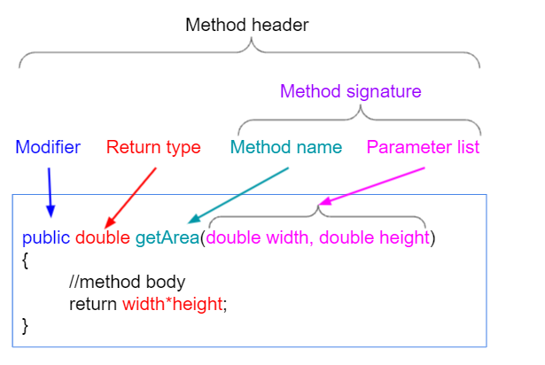

# Methods in Java
*	A method is a block of code or collection of statements or a set of code grouped together to perform a certain task or operation.
*	It is used to achieve the reusability of code. 
*	We write a method once and use it many times. We do not require to write code again and again. 
*	The method is executed only when we call or invoke it. 

# Types of Method
There are two types of methods in Java:
* Predefined Method
* User-defined Method

# Point to Notice:
* you cannot declare a method as private.

