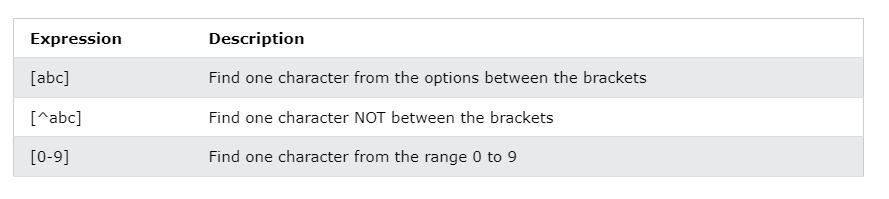
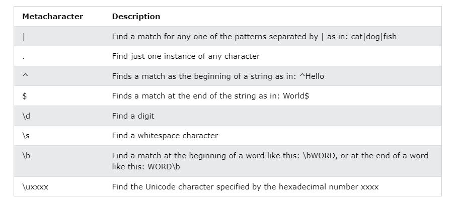
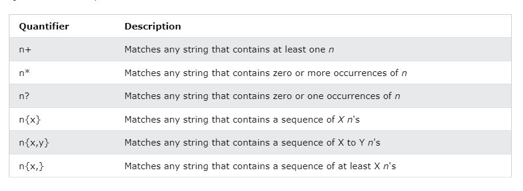

# Regular Expression-particular Pattern
example: Mobile, Email ID
8344777333 hr@google.com

File -Mobile No
File -Pin Code
File -Email No

java.util.regex -API(package)

# class inside the regex
1) Pattern -
compiled representation of regex
2) Matcher -Interpretes the pattern
find,group,start,end
3) PatternSyntaxException - Unchecked Exception


# Where we can apply the this

1) Chatbot Application
2) Form- checking valid email,contact number
3) Compiler,Interface, Assembler
4) TCP IP Protocals
5) Digital Circuts

```java
public class Regex {
	public static void main(String[] args) {
		System.out.println("IPv4: " + ipv4Adresse("192.168.100.1"));
		System.out.println("IPv6: " + ipv6Adressen("2001:0db8:85a3:08d3:1319:8a2e:0370:7344"));
		System.out.println("MAC-Adresse: " + macAdressen("88:66:5a:44:a9:12"));
		System.out.println("Flugnummer: " + flugNummer("AIR2D3E"));
		System.out.println("Zahlen: " + zahlen("123.3123123"));
		System.out.println("Datum: " + datum("31.12.2021"));
		System.out.println("Kennzeichen: " + kennzeichen("WE-12FR")); // XX-XXXX oder X-XXXXXX Leerzeichen muss angegeben werden
		System.out.println("E-Mail Adressen: " + emailAdressen("muster@muster.de"));
	}

	public static boolean ipv4Adress(String ipAdress) {
		Pattern pattern = Pattern.compile("^([0-9]{1,3})\\.([0-9]{1,3})\\.([0-9]{1,3})\\.([0-9]{1,3})$", Pattern.CASE_INSENSITIVE);
		Matcher matcher = pattern.matcher(ipAdress);
		return matcher.find();
	}

	public static boolean ipv6Adress(String ipAdress) {
		Pattern pattern = Pattern.compile("^(?:[A-F0-9]{1,4}:){7}[A-F0-9]{1,4}$", Pattern.CASE_INSENSITIVE);
		Matcher matcher = pattern.matcher(ipAdress);
		return matcher.find();
	}

	public static boolean macAdressen(String macAddress) {
		Pattern pattern = Pattern.compile("((?:[a-zA-Z0-9]{2}[:-]){5}[a-zA-Z0-9]{2})", Pattern.CASE_INSENSITIVE);
		Matcher matcher = pattern.matcher(macAddress);
		return matcher.find();
	}

	public static boolean flightNumber(String flightnumber) {
		Pattern pattern = Pattern.compile("(^[A-Z]{2,3})([\\w\\d]{2,4}$)", Pattern.CASE_INSENSITIVE);
		Matcher matcher = pattern.matcher(flightnumber);
		return matcher.find();
	}

	public static boolean number(String number) {
		Pattern pattern = Pattern.compile("(^[\\d]+$)|(^[\\d.\\d]+$)", Pattern.CASE_INSENSITIVE);
		//String meinString = Double.toString(nummer);
		Matcher matcher = pattern.matcher(number);
		return matcher.find();
	}

	public static boolean date(String date) {
		Pattern pattern = Pattern.compile("^(?<day>1[0-9]|2[0-9]|3[0-1]).(?<month>1[0-2]|0[1-9]).(?<year>[0-9]{4})$", Pattern.CASE_INSENSITIVE);
		Matcher matcher = pattern.matcher(date);
		return matcher.find();
	}

	public static boolean kennzeichen(String kennzeichen) {
		Pattern pattern = Pattern.compile("(^[A-Z]{1,2}-\\d\\w{3,5}$)", Pattern.CASE_INSENSITIVE);
		Matcher matcher = pattern.matcher(kennzeichen);
		return matcher.find();
	}

	public static boolean emailAdressen(String emailAdressen) {
		Pattern pattern = Pattern.compile("^[A-Z0-9_!#$%&'*+/=?`{|}~^-]+(?:\\.[A-Z0-9_!#$%&'*+/=?`{|}~^-]+↵\n" +
				")*@[A-Z0-9-]+(?:\\.[A-Z0-9-]+)*$", Pattern.CASE_INSENSITIVE);
		Matcher matcher = pattern.matcher(emailAdressen);
		return matcher.find();
	}
}
```

# Programs- Character classes
1) Starting word in given sentence - ^regex
2) Ending word in given sentence - regex$
3) Any two characters in a given sentence -T|a
4) [] Grouping -Character classes


[] Grouping -Character classes
Pattern.compile("[abc]");//Either a or b or compile.
Pattern.compile("[^ab]");//Except a or b.
Pattern.compile("[a-zA-Z]");//all alphabet caps and small.
Pattern.compile("[a-zA-Z0-9]")//all alphabet and number.
Pattern.compile("[^a-zA-Z0-9]");//print all special character




# predefined character classes-(Meta Character classes)
In Java's regular expressions, predefined character classes represent common sets of characters. Here are some of the predefined character classes along with their meanings:

1. `\d`: Matches any digit character. It is equivalent to `[0-9]`.
2. `\D`: Matches any non-digit character. It is equivalent to `[^0-9]`.
3. `\s`: Matches any whitespace character, including space, tab, newline, etc.
4. `\S`: Matches any non-whitespace character.
5. `\w`: Matches any word character, which includes letters, digits, and underscore (`_`).
6. `\W`: Matches any non-word character.
7. `.`: Matches any character except newline (`\n`).
8. `\\G` : is an anchor that matches the position where the previous match ended. It's known as the "end of the previous match" anchor.




# Example for word boundry:
`\bword\b matches "word" only when it appears as a whole word, not as part of another word (e.g., "sword" or "wording" wouldn't match).
\b\d+\b matches sequences of digits (e.g., "123", "4567") as whole numbers.
\b\w{3}\b matches three-letter words (e.g., "cat", "dog", "car") but not within longer words.`

These predefined character classes can be used inside character classes (`[]`) or in combination with other regular expression constructs to specify patterns for matching text.

# Example for word \w:
In regular expressions, `\w` is a character class that matches any word character. Word characters typically include letters (both uppercase and lowercase), digits, and underscores. 

Here's a breakdown of `\w`:

1. **Letters**: Matches any alphabetical character, both uppercase and lowercase (e.g., a-z, A-Z).

2. **Digits**: Matches any digit (0-9).

3. **Underscore**: Matches the underscore character (_).

For example, the regular expression `\w+` would match one or more consecutive word characters.

Here are some examples of how `\w` can be used:

- `\w` matches a single word character.
- `\w+` matches one or more consecutive word characters.
- `\w\d` matches a word character followed by a digit.
- `\w_` matches a word character followed by an underscore.


# Quantifiers
Quantifiers in regular expressions specify the number of occurrences of a character or a group in a pattern. Here's a list of quantifiers commonly used in regular expressions:

1. `*`: Any number of mactches including zero.
2. `+`: Atleast one match.
3. `?`: Atmost one macth
4. `{n}`: Matches exactly `n` occurrences of the preceding element.
5. `{n,}`: Matches `n` or more occurrences of the preceding element.
6. `{n,m}`: Matches at least `n` and at most `m` occurrences of the preceding element.



## For example:
- `a*` matches "", "a", "aa", "aaa", etc.
- `a+` matches "a", "aa", "aaa", etc. but not "".
- `a?` matches "", "a".
- `a{3}` matches "aaa" but not "aa" or "aaaa".
- `a{2,}` matches "aa", "aaa", "aaaa", etc.
- `a{2,4}` matches "aa", "aaa", or "aaaa" but not "a" or "aaaaa".

These quantifiers allow you to specify flexible patterns for matching text efficiently.


# split() method

1) Pattern -split method
2) String -split method --split into array
```java
String text = "apple,orange,banana";
String[] fruits = text.split(",");
for (String fruit : fruits) {
    System.out.println(fruit);
}
```
```Output
apple
orange
banana
```

# String Tokenizer class - `java.util.StringTokenizer`

StringTokenizer- it is a legacy class.(older version usage also used for csv files)
split()


